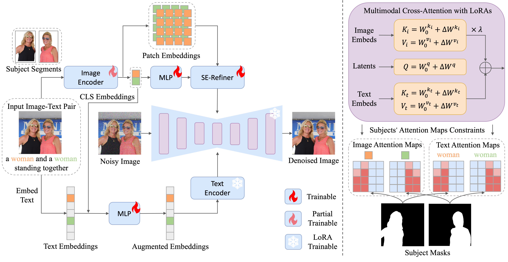

<div align="center">
<h2><center>👉 MM-Diff: High-Fidelity Image Personalization via Multi-Modal Condition Integration</h2>

[Zhichao Wei](), [Qingkun Su](), [Long Qin](), [Weizhi Wang]()

<a href='https://arxiv.org/pdf/2403.15059'></a> 
<a href='https://mm-diff.github.io/'></a>  
</div>

## 🔥 **Examples**


## 🎇 **Pipeline**



We propose MM-Diff, a unified and tuning-free image personalization framework capable of generating high-fidelity images of both single and multiple subjects in seconds. On the left, the vision-augmented text embeddings and a small set of detail-rich subject embeddings are injected into the diffusion model through the well-designed multi-modal cross-attention. On the right, we illustrate the details of the innovative implementation of cross-attention with LoRAs, as well as the attention constraints that facilitate multi-subject generation.

## 🔧 **Preparations**

### Environment Setup

```shell
conda create -n mmdiff python=3.9
conda activate mmdiff
pip install -r requirements.txt
```

### Download Models

We provide the pretrained [checkpoints](https://cloudbook-public-daily.oss-cn-hangzhou.aliyuncs.com/Personalization/checkpoints/checkpoints.tar.gz). One can download and put them in the root path of the current project. To run the demo, you should also download the following models:
- [stabilityai/stable-diffusion-xl-base-1.0](https://huggingface.co/stabilityai/stable-diffusion-xl-base-1.0)
- [madebyollin/sdxl-vae-fp16-fix](https://huggingface.co/madebyollin/sdxl-vae-fp16-fix)
- [openai/clip-vit-large-patch14](https://huggingface.co/openai/clip-vit-large-patch14)

### Training Data Annotation (Optional)

We provide the demo code for training data annotation in [data_annotation](./data_annotation/). To avoid package conflicts, it is best to configure a new conda or docker environment.

```python
python data_labeling_imagenet.py --data_path="path_to_data"
```

## ✨ **Customized Generation**

Currently, we provide two ways to customize your images as follows. We also provide some reference images in [demo_data](./demo_data).

### Use Jupyter Notebook
- [**mmdiff_demo**](mmdiff_demo.ipynb), image generation with single reference image.
- [**mmdiff_multiple_reference_demo**](mmdiff_demo.ipynb), image generation with multiple reference images.
- [**mmdiff_id_mixing_demo**](mmdiff_demo.ipynb), image generation with identity mixing.


### Start a Gradio Demo
```python
python mmdiff_gradio_demo.py
```

## 🚩 **Updates**
- [2024/05/30] Fuse lora weights into orignal weights to improve inference speed.
- [2024/05/29] Release an enhanced version of MM-Diff for portrait generation, employing face embeddings to improve subject fidelity.

## **Citation**

If you find MM-Diff useful for your research, please cite our paper:

```bibtex
@article{wei2024mm,
  title={MM-Diff: High-Fidelity Image Personalization via Multi-Modal Condition Integration},
  author={Wei, Zhichao and Su, Qingkun and Qin, Long and Wang, Weizhi},
  journal={arXiv preprint arXiv:2403.15059},
  year={2024}
}
```

## **Acknowledgements**

This code is built on some excellent repos, including [diffusers](https://github.com/huggingface/diffusers), [FastComposer](https://github.com/mit-han-lab/fastcomposer/tree/main/fastcomposer), [PhotoMaker](https://github.com/TencentARC/PhotoMaker) and [IP-Adapter](https://github.com/tencent-ailab/IP-Adapter). Thanks for their great work!